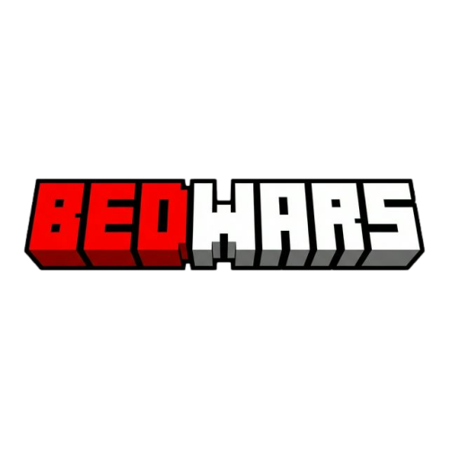
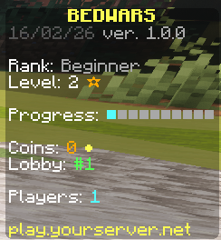

<p align="center">
  
</p>

# BedWars

A modern BedWars plugin for Spigot/Paper/Purpur servers with arenas, teams, generators, shop, upgrades, NPCs, and player stats (XP + levels).

## Showcase

### Scoreboard

<p align="center">
  
  
  
</p>

### Lobby & NPCs

<p align="center">
  
  
</p>

### In-Game Features

<p align="center">
  
  
  
</p>

### Death & Respawn

<p align="center">
  
</p>

### Arena Setup

<p align="center">
  
</p>

## Key Features

- Team-size based modes: Solo, Duo, Trio, Squad
- Full match flow: lobby, countdown, start, in-game events, ending
- Team shop + team upgrades + traps
- NPCs (Villager/Player) for shop, upgrades, and mode joining
- Standalone NPC persistence (save/load) in database
- Bed and team-status holograms
- Multilingual messages and scoreboard (EN/PL)
- Player statistics with XP/level progression
- Fast joining by arena name, group, or `random`
- SQLite or MySQL support (HikariCP)
- Optional hooks: PlaceholderAPI, Citizens, Vault

## Requirements

- Java 8+
- Spigot/Paper/Purpur server (API 1.13+)

## Installation

1. Put the plugin JAR into your `plugins/` folder.
2. Start the server once to generate config files.
3. Configure files in the plugin folder (`config.yml`, `Languages/*`, etc.).
4. Restart the server or use `/bw admin reload`.

## Quick Setup

Minimal example flow:

1. Set main lobby:
   - `/bw admin setlobby`
2. Create arena:
   - `/bw admin arena create test`
3. Open arena editor:
   - `/bw admin arena edit test`
4. Configure teams/spawns/beds/generators in the editor GUI.
5. Enable arena:
   - `/bw admin arena enable test`
6. (Optional) Force start:
   - `/bw admin start test`

## Commands

### Player

- `/bw join` — opens the join GUI
- `/bw join <arena>` — join a specific arena
- `/bw join <group>` — join by group (best available arena)
- `/bw join random` — quick random join
- `/bw leave` — leave current arena
- `/bw lobby` — teleport to main lobby
- `/bw rejoin` — rejoin your last arena
- `/bw stats [player]` — view statistics

### Admin

- `/bw admin reload`
- `/bw admin setlobby`
- `/bw admin lang <iso>`
- `/bw admin build <on|off>`
- `/bw admin npc <type>`
- `/bw admin npc remove`
- `/bw admin arena create <name>`
- `/bw admin arena edit <name>`
- `/bw admin arena enable <name>`
- `/bw admin arena disable <name>`
- `/bw admin arena delete <name>`
- `/bw admin arena group <name> <group>`
- `/bw admin start <arena>`
- `/bw admin sign join <arena>`

## Permissions

- `bedwars.use` — basic BedWars usage
- `bedwars.admin` — full admin access
- `bedwars.setup` — arena setup/edit access
- `bedwars.command.rejoin` — access to `/bw rejoin`
- `bedwars.command.reload` — access to reload
- `bedwars.command.lang` — access to language switching

## Configuration

Main files:

- `config.yml` — core plugin config, DB, groups, join GUI
- `levels.yml` — XP and level configuration
- `permissions.yml` — permission node descriptions
- `Languages/en/*` and `Languages/pl/*` — messages, shop, upgrades, NPC, sounds

## Database

Supported backends:

- `sqlite` (default)
- `mysql`

Data persisted in DB includes:

- player statistics
- plugin settings
- player quick buy data
- arena/team/generator/sign data
- standalone NPC data


## Languages

- English
- Polish

## Build from Source

```bash
mvn clean package
```

The built JAR will be available in the `target/` folder.

## Soft Dependencies

- PlaceholderAPI
- Citizens
- Vault

The plugin works without them, but integrations are enabled only when those plugins are installed.
